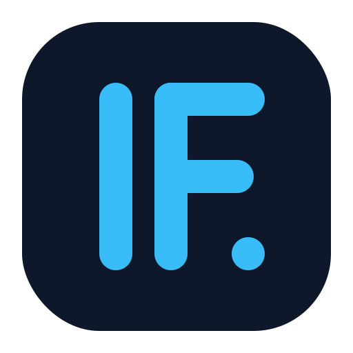
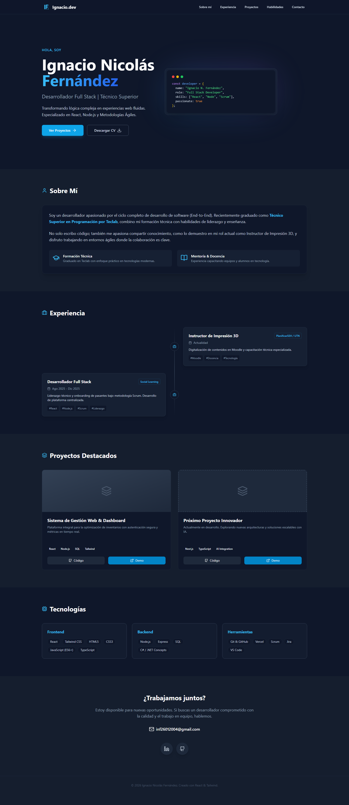

<div align="center">
  <a href="https://ignacio-fernandez-dev.vercel.app" target="_blank">
    
  </a>

  <h1 align="center">Portafolio Personal | Ignacio Nicolás Fernández</h1>

  <p align="center">
    <strong>Desarrollador Full Stack & Técnico Superior en Programación</strong>
    <br />
    Un espacio minimalista y moderno para exhibir mis proyectos y experiencia técnica.
    <br />
    <br />
    <a href="https://ignacio-fernandez-dev.vercel.app"><strong>🚀 Ver Demo en Vivo</strong></a>
    ·
    <a href="#-reportar-error">Reportar Error</a>
    ·
    <a href="#-contacto">Contactar</a>
  </p>
  
  <p align="center">
    
    
    
    
  </p>
</div>

<details>
  <summary>Tabla de Contenidos</summary>
  <ol>
    <li><a href="#-sobre-el-proyecto">Sobre el Proyecto</a></li>
    <li><a href="#-tecnologías-utilizadas">Tecnologías Utilizadas</a></li>
    <li><a href="#-instalación-y-uso">Instalación y Uso</a></li>
    <li><a href="#-estructura-del-proyecto">Estructura</a></li>
    <li><a href="#-contacto">Contacto</a></li>
  </ol>
</details>

---

## 📸 Captura de Pantalla



## 💡 Sobre el Proyecto

Este portafolio fue diseñado siguiendo principios de **"Clean Code"** y **Diseño UI/UX Moderno**. El objetivo es presentar mi trayectoria como desarrollador y docente de una manera fluida, interactiva y totalmente responsiva.

### ✨ Características Principales:

- **Modo Oscuro Profundo:** Paleta de colores `Slate-900` personalizada para reducir fatiga visual.
- **Animaciones Suaves:** Transiciones de entrada al hacer scroll utilizando `Framer Motion`.
- **Diseño Responsive:** Adaptable a móviles, tablets y escritorio ("Mobile First").
- **Glassmorphism:** Efectos de desenfoque en la barra de navegación.
- **Performance:** Optimizado con Vite para una carga instantánea.

---

## 🛠 Tecnologías Utilizadas

Este proyecto utiliza un stack moderno enfocado en performance y escalabilidad:

- **Core:** [React](https://reactjs.org/) (Hooks, Functional Components)
- **Lenguaje:** [TypeScript](https://www.typescriptlang.org/) (Tipado estático estricto)
- **Estilos:** [Tailwind CSS](https://tailwindcss.com/) (Utility-first framework)
- **Build Tool:** [Vite](https://vitejs.dev/)
- **Iconos:** [Lucide React](https://lucide.dev/)
- **Animaciones:** [Framer Motion](https://www.framer.com/motion/)

---

## 🚀 Instalación y Uso

Si deseas clonar este repositorio para probarlo localmente:

1.  **Clonar el repositorio**

    ```bash
    git clone [https://github.com/TU_USUARIO/portfolio.git](https://github.com/TU_USUARIO/portfolio.git)
    ```

2.  **Instalar dependencias**

    ```bash
    cd portfolio
    npm install
    ```

3.  **Iniciar servidor de desarrollo**

    ```bash
    npm run dev
    ```

4.  **Construir para producción**
    ```bash
    npm run build
    ```

---

## 📂 Estructura del Proyecto

La arquitectura de carpetas está organizada para facilitar el mantenimiento:

```text
src/
├── components/       # Componentes reutilizables (Hero, About, etc.)
│   ├── RevealOnScroll.tsx  # Wrapper para animaciones
│   └── ...
├── assets/           # Recursos estáticos
├── App.tsx           # Componente principal
└── main.tsx          # Punto de entrada
```
